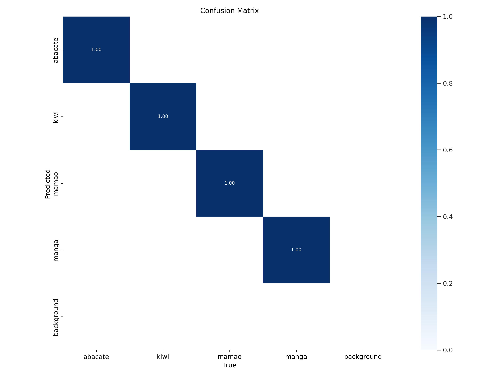
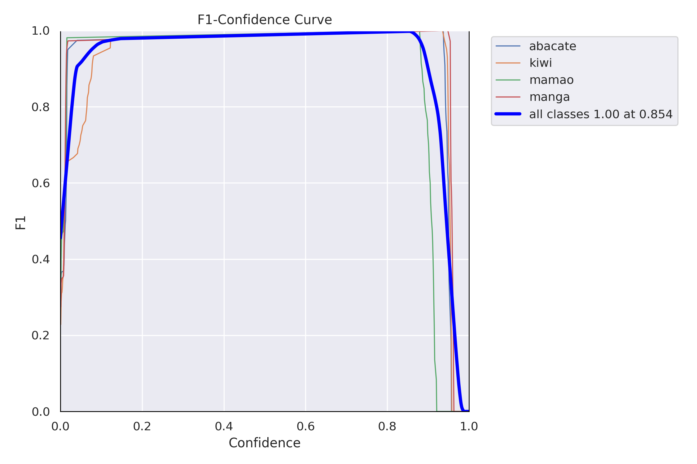
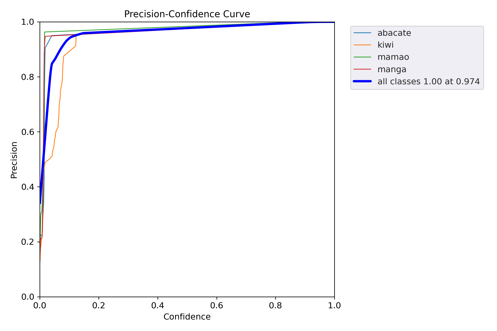

# Projeto Final - Modelos Preditivos Conexionistas

### André Ferreira

|**Tipo de Projeto**|**Modelo Selecionado**|**Linguagem**|
|--|--|--|
|Classificação de Imagens|YOLOv5|PyTorch|

## Requisitos

- Python >=3.10
- [Pipenv](https://pipenv.pypa.io/en/latest/index.html) instalado

## Performance

O modelo treinado possui performance de **99,50 %**.

### Output do bloco de treinamento

<details>
  <summary>Click to expand!</summary>
  
  ```text
    Epoch    GPU_mem   box_loss   obj_loss   cls_loss  Instances       Size
       0/99         0G     0.1164    0.02865    0.04516         53        640: 1
                 Class     Images  Instances          P          R      mAP50   WARNING ⚠️ NMS time limit 3.200s exceeded
                 Class     Images  Instances          P          R      mAP50   WARNING ⚠️ NMS time limit 2.000s exceeded
                 Class     Images  Instances          P          R      mAP50   
                   all         84         84   0.000309     0.0646     0.0002   6.37e-05

      Epoch    GPU_mem   box_loss   obj_loss   cls_loss  Instances       Size
       1/99         0G     0.1061    0.02819    0.04221         52        640: 1
                 Class     Images  Instances          P          R      mAP50   WARNING ⚠️ NMS time limit 3.200s exceeded
                 Class     Images  Instances          P          R      mAP50   WARNING ⚠️ NMS time limit 2.000s exceeded
                 Class     Images  Instances          P          R      mAP50   
                   all         84         84    0.00182      0.451    0.00966    0.00178

      Epoch    GPU_mem   box_loss   obj_loss   cls_loss  Instances       Size
       2/99         0G    0.07826    0.02961     0.0376         41        640: 1
                 Class     Images  Instances          P          R      mAP50   
                   all         84         84    0.00369      0.952      0.206      0.069

      Epoch    GPU_mem   box_loss   obj_loss   cls_loss  Instances       Size
       3/99         0G    0.06001    0.02908    0.03203         45        640: 1
                 Class     Images  Instances          P          R      mAP50   
                   all         84         84     0.0381          1      0.448      0.177

      Epoch    GPU_mem   box_loss   obj_loss   cls_loss  Instances       Size
       4/99         0G     0.0569    0.02521     0.0361         36        640: 1
                 Class     Images  Instances          P          R      mAP50   
                   all         84         84      0.507      0.724      0.752      0.475

      Epoch    GPU_mem   box_loss   obj_loss   cls_loss  Instances       Size
       5/99         0G    0.05547    0.02243    0.03416         40        640: 1
                 Class     Images  Instances          P          R      mAP50   
                   all         84         84      0.675      0.799       0.98      0.593

      Epoch    GPU_mem   box_loss   obj_loss   cls_loss  Instances       Size
       6/99         0G    0.05748    0.01939    0.03041         46        640: 1
                 Class     Images  Instances          P          R      mAP50   
                   all         84         84      0.805      0.265       0.42      0.111

      Epoch    GPU_mem   box_loss   obj_loss   cls_loss  Instances       Size
       7/99         0G    0.05392    0.01874    0.02469         42        640: 1
                 Class     Images  Instances          P          R      mAP50   
                   all         84         84      0.393      0.724      0.712      0.317

      Epoch    GPU_mem   box_loss   obj_loss   cls_loss  Instances       Size
       8/99         0G    0.05796    0.01721    0.02546         41        640: 1
                 Class     Images  Instances          P          R      mAP50   
                   all         84         84      0.451      0.658      0.662      0.359

      Epoch    GPU_mem   box_loss   obj_loss   cls_loss  Instances       Size
       9/99         0G    0.05739    0.01833    0.02054         49        640: 1
                 Class     Images  Instances          P          R      mAP50   
                   all         84         84      0.471      0.825      0.734      0.282

      Epoch    GPU_mem   box_loss   obj_loss   cls_loss  Instances       Size
      10/99         0G    0.05328    0.01591    0.02335         45        640: 1
                 Class     Images  Instances          P          R      mAP50   
                   all         84         84      0.648      0.912      0.878      0.493

      Epoch    GPU_mem   box_loss   obj_loss   cls_loss  Instances       Size
      11/99         0G    0.06263    0.01544    0.01662         42        640: 1
                 Class     Images  Instances          P          R      mAP50   
                   all         84         84      0.666      0.926      0.729      0.356

      Epoch    GPU_mem   box_loss   obj_loss   cls_loss  Instances       Size
      12/99         0G     0.0592    0.01472    0.01638         53        640: 1
                 Class     Images  Instances          P          R      mAP50   
                   all         84         84      0.581      0.917      0.707      0.289

      Epoch    GPU_mem   box_loss   obj_loss   cls_loss  Instances       Size
      13/99         0G    0.06015    0.01341    0.01401         39        640: 1
                 Class     Images  Instances          P          R      mAP50   
                   all         84         84      0.791      0.983      0.928      0.385

      Epoch    GPU_mem   box_loss   obj_loss   cls_loss  Instances       Size
      14/99         0G    0.05354    0.01268    0.01574         49        640: 1
                 Class     Images  Instances          P          R      mAP50   
                   all         84         84      0.546      0.789      0.608       0.32

      Epoch    GPU_mem   box_loss   obj_loss   cls_loss  Instances       Size
      15/99         0G    0.05424    0.01105   0.008662         33        640: 1
                 Class     Images  Instances          P          R      mAP50   
                   all         84         84      0.433      0.915      0.629      0.266

      Epoch    GPU_mem   box_loss   obj_loss   cls_loss  Instances       Size
      16/99         0G    0.05971    0.01189    0.01095         40        640: 1
                 Class     Images  Instances          P          R      mAP50   
                   all         84         84      0.547      0.924      0.853      0.463

      Epoch    GPU_mem   box_loss   obj_loss   cls_loss  Instances       Size
      17/99         0G    0.05077    0.01178    0.01044         53        640: 1
                 Class     Images  Instances          P          R      mAP50   
                   all         84         84      0.712      0.904      0.861      0.454

      Epoch    GPU_mem   box_loss   obj_loss   cls_loss  Instances       Size
      18/99         0G    0.04519    0.01137   0.009303         46        640: 1
                 Class     Images  Instances          P          R      mAP50   
                   all         84         84      0.462       0.95      0.825      0.491

      Epoch    GPU_mem   box_loss   obj_loss   cls_loss  Instances       Size
      19/99         0G    0.05215   0.009745   0.008352         48        640: 1
                 Class     Images  Instances          P          R      mAP50   
                   all         84         84      0.507      0.978      0.922       0.64

      Epoch    GPU_mem   box_loss   obj_loss   cls_loss  Instances       Size
      20/99         0G    0.04896   0.009743   0.007397         41        640: 1
                 Class     Images  Instances          P          R      mAP50   
                   all         84         84      0.377      0.971      0.691      0.328

      Epoch    GPU_mem   box_loss   obj_loss   cls_loss  Instances       Size
      21/99         0G    0.05834   0.009947   0.006149         44        640: 1
                 Class     Images  Instances          P          R      mAP50   
                   all         84         84      0.825      0.952      0.968      0.523

      Epoch    GPU_mem   box_loss   obj_loss   cls_loss  Instances       Size
      22/99         0G    0.05358   0.009512   0.007248         37        640: 1
                 Class     Images  Instances          P          R      mAP50   
                   all         84         84      0.787      0.978      0.937       0.51

      Epoch    GPU_mem   box_loss   obj_loss   cls_loss  Instances       Size
      23/99         0G    0.04744    0.01061   0.006521         40        640: 1
                 Class     Images  Instances          P          R      mAP50   
                   all         84         84      0.895        0.7      0.903      0.372

      Epoch    GPU_mem   box_loss   obj_loss   cls_loss  Instances       Size
      24/99         0G    0.05186    0.01077   0.007834         43        640: 1
                 Class     Images  Instances          P          R      mAP50   
                   all         84         84      0.764      0.937      0.917      0.527

      Epoch    GPU_mem   box_loss   obj_loss   cls_loss  Instances       Size
      25/99         0G    0.03916   0.008841   0.005891         37        640: 1
                 Class     Images  Instances          P          R      mAP50   
                   all         84         84      0.745      0.916      0.927      0.507

      Epoch    GPU_mem   box_loss   obj_loss   cls_loss  Instances       Size
      26/99         0G    0.04778    0.01078   0.006352         51        640: 1
                 Class     Images  Instances          P          R      mAP50   
                   all         84         84      0.785      0.917      0.891      0.447

      Epoch    GPU_mem   box_loss   obj_loss   cls_loss  Instances       Size
      27/99         0G    0.04426   0.009191    0.00533         36        640: 1
                 Class     Images  Instances          P          R      mAP50   
                   all         84         84      0.888       0.96      0.981      0.645

      Epoch    GPU_mem   box_loss   obj_loss   cls_loss  Instances       Size
      28/99         0G    0.04532   0.008635   0.007207         42        640: 1
                 Class     Images  Instances          P          R      mAP50   
                   all         84         84      0.709          1      0.919      0.538

      Epoch    GPU_mem   box_loss   obj_loss   cls_loss  Instances       Size
      29/99         0G    0.04246   0.008149   0.006029         40        640: 1
                 Class     Images  Instances          P          R      mAP50   
                   all         84         84      0.858      0.643      0.865      0.674

      Epoch    GPU_mem   box_loss   obj_loss   cls_loss  Instances       Size
      30/99         0G      0.041   0.009422   0.006245         48        640: 1
                 Class     Images  Instances          P          R      mAP50   
                   all         84         84      0.939      0.962      0.981      0.656

      Epoch    GPU_mem   box_loss   obj_loss   cls_loss  Instances       Size
      31/99         0G    0.03957   0.008634   0.004191         51        640: 1
                 Class     Images  Instances          P          R      mAP50   
                   all         84         84      0.769      0.939      0.976      0.716

      Epoch    GPU_mem   box_loss   obj_loss   cls_loss  Instances       Size
      32/99         0G     0.0395   0.008625   0.003282         46        640: 1
                 Class     Images  Instances          P          R      mAP50   
                   all         84         84      0.872      0.992      0.941       0.64

      Epoch    GPU_mem   box_loss   obj_loss   cls_loss  Instances       Size
      33/99         0G    0.04042    0.00806   0.003379         38        640: 1
                 Class     Images  Instances          P          R      mAP50   
                   all         84         84      0.949      0.948       0.97      0.581

      Epoch    GPU_mem   box_loss   obj_loss   cls_loss  Instances       Size
      34/99         0G    0.03828   0.008692   0.003797         32        640: 1
                 Class     Images  Instances          P          R      mAP50   
                   all         84         84      0.796      0.952      0.938      0.725

      Epoch    GPU_mem   box_loss   obj_loss   cls_loss  Instances       Size
      35/99         0G    0.03644    0.00794   0.006154         39        640: 1
                 Class     Images  Instances          P          R      mAP50   
                   all         84         84      0.834      0.965      0.937      0.651

      Epoch    GPU_mem   box_loss   obj_loss   cls_loss  Instances       Size
      36/99         0G    0.03705   0.008637   0.006474         42        640: 1
                 Class     Images  Instances          P          R      mAP50   
                   all         84         84      0.605          1      0.979      0.715

      Epoch    GPU_mem   box_loss   obj_loss   cls_loss  Instances       Size
      37/99         0G    0.03774   0.008382   0.006012         56        640: 1
                 Class     Images  Instances          P          R      mAP50   
                   all         84         84      0.822      0.981      0.991      0.727

      Epoch    GPU_mem   box_loss   obj_loss   cls_loss  Instances       Size
      38/99         0G    0.03946   0.008283   0.005056         41        640: 1
                 Class     Images  Instances          P          R      mAP50   
                   all         84         84      0.851      0.996      0.994       0.55

      Epoch    GPU_mem   box_loss   obj_loss   cls_loss  Instances       Size
      39/99         0G    0.04047   0.008023    0.01019         45        640: 1
                 Class     Images  Instances          P          R      mAP50   
                   all         84         84      0.985          1      0.995      0.754

      Epoch    GPU_mem   box_loss   obj_loss   cls_loss  Instances       Size
      40/99         0G    0.03786   0.007725   0.003889         43        640: 1
                 Class     Images  Instances          P          R      mAP50   
                   all         84         84       0.85          1      0.985      0.685

      Epoch    GPU_mem   box_loss   obj_loss   cls_loss  Instances       Size
      41/99         0G    0.03319    0.00748   0.005398         39        640: 1
                 Class     Images  Instances          P          R      mAP50   
                   all         84         84      0.983          1      0.995      0.864

      Epoch    GPU_mem   box_loss   obj_loss   cls_loss  Instances       Size
      42/99         0G    0.03307   0.007172   0.004421         35        640: 1
                 Class     Images  Instances          P          R      mAP50   
                   all         84         84      0.856          1      0.995      0.696

      Epoch    GPU_mem   box_loss   obj_loss   cls_loss  Instances       Size
      43/99         0G    0.03717   0.007269   0.003994         33        640: 1
                 Class     Images  Instances          P          R      mAP50   
                   all         84         84      0.954          1      0.993       0.79

      Epoch    GPU_mem   box_loss   obj_loss   cls_loss  Instances       Size
      44/99         0G    0.04116   0.008095   0.006831         34        640: 1
                 Class     Images  Instances          P          R      mAP50   
                   all         84         84      0.992          1      0.995      0.749

      Epoch    GPU_mem   box_loss   obj_loss   cls_loss  Instances       Size
      45/99         0G    0.03333   0.007161    0.00287         40        640: 1
                 Class     Images  Instances          P          R      mAP50   
                   all         84         84      0.984          1      0.995      0.679

      Epoch    GPU_mem   box_loss   obj_loss   cls_loss  Instances       Size
      46/99         0G    0.02835   0.007247    0.00457         47        640: 1
                 Class     Images  Instances          P          R      mAP50   
                   all         84         84      0.896          1      0.995      0.707

      Epoch    GPU_mem   box_loss   obj_loss   cls_loss  Instances       Size
      47/99         0G    0.03728   0.007194   0.004385         39        640: 1
                 Class     Images  Instances          P          R      mAP50   
                   all         84         84      0.959          1      0.995      0.755

      Epoch    GPU_mem   box_loss   obj_loss   cls_loss  Instances       Size
      48/99         0G    0.03746   0.007951   0.007165         39        640: 1
                 Class     Images  Instances          P          R      mAP50   
                   all         84         84      0.991      0.998      0.995      0.839

      Epoch    GPU_mem   box_loss   obj_loss   cls_loss  Instances       Size
      49/99         0G     0.0295    0.00687   0.007014         43        640: 1
                 Class     Images  Instances          P          R      mAP50   
                   all         84         84      0.989          1      0.995      0.816

      Epoch    GPU_mem   box_loss   obj_loss   cls_loss  Instances       Size
      50/99         0G    0.03438   0.007568   0.004476         44        640: 1
                 Class     Images  Instances          P          R      mAP50   
                   all         84         84      0.986      0.998      0.995      0.825

      Epoch    GPU_mem   box_loss   obj_loss   cls_loss  Instances       Size
      51/99         0G    0.02984   0.006485   0.004544         40        640: 1
                 Class     Images  Instances          P          R      mAP50   
                   all         84         84       0.96      0.993      0.995      0.894

      Epoch    GPU_mem   box_loss   obj_loss   cls_loss  Instances       Size
      52/99         0G    0.03681   0.006895   0.003793         44        640: 1
                 Class     Images  Instances          P          R      mAP50   
                   all         84         84      0.958      0.992      0.995       0.77

      Epoch    GPU_mem   box_loss   obj_loss   cls_loss  Instances       Size
      53/99         0G    0.02868   0.006433   0.005848         38        640: 1
                 Class     Images  Instances          P          R      mAP50   
                   all         84         84      0.844      0.987      0.995      0.912

      Epoch    GPU_mem   box_loss   obj_loss   cls_loss  Instances       Size
      54/99         0G     0.0383   0.006939    0.00508         43        640: 1
                 Class     Images  Instances          P          R      mAP50   
                   all         84         84      0.977      0.991      0.995      0.839

      Epoch    GPU_mem   box_loss   obj_loss   cls_loss  Instances       Size
      55/99         0G    0.03043   0.007463   0.002906         36        640: 1
                 Class     Images  Instances          P          R      mAP50   
                   all         84         84      0.937      0.992      0.994      0.776

      Epoch    GPU_mem   box_loss   obj_loss   cls_loss  Instances       Size
      56/99         0G    0.03536   0.007067   0.005278         43        640: 1
                 Class     Images  Instances          P          R      mAP50   
                   all         84         84      0.887      0.962      0.958      0.858

      Epoch    GPU_mem   box_loss   obj_loss   cls_loss  Instances       Size
      57/99         0G    0.02841   0.006787   0.002623         49        640: 1
                 Class     Images  Instances          P          R      mAP50   
                   all         84         84      0.983      0.998      0.995       0.82

      Epoch    GPU_mem   box_loss   obj_loss   cls_loss  Instances       Size
      58/99         0G     0.0236   0.006943   0.002264         48        640: 1
                 Class     Images  Instances          P          R      mAP50   
                   all         84         84      0.985      0.999      0.995      0.832

      Epoch    GPU_mem   box_loss   obj_loss   cls_loss  Instances       Size
      59/99         0G    0.03041   0.007039   0.002205         37        640: 1
                 Class     Images  Instances          P          R      mAP50   
                   all         84         84      0.989          1      0.995      0.859

      Epoch    GPU_mem   box_loss   obj_loss   cls_loss  Instances       Size
      60/99         0G    0.02639   0.007144   0.001906         50        640: 1
                 Class     Images  Instances          P          R      mAP50   
                   all         84         84      0.987      0.998      0.995      0.854

      Epoch    GPU_mem   box_loss   obj_loss   cls_loss  Instances       Size
      61/99         0G    0.02619   0.007172   0.001964         42        640: 1
                 Class     Images  Instances          P          R      mAP50   
                   all         84         84      0.992      0.992      0.995      0.859

      Epoch    GPU_mem   box_loss   obj_loss   cls_loss  Instances       Size
      62/99         0G    0.02696    0.00638   0.002354         36        640: 1
                 Class     Images  Instances          P          R      mAP50   
                   all         84         84      0.988      0.998      0.995      0.821

      Epoch    GPU_mem   box_loss   obj_loss   cls_loss  Instances       Size
      63/99         0G    0.02404   0.007005   0.001917         57        640: 1
                 Class     Images  Instances          P          R      mAP50   
                   all         84         84      0.992          1      0.995       0.89

      Epoch    GPU_mem   box_loss   obj_loss   cls_loss  Instances       Size
      64/99         0G    0.02856   0.006901    0.00365         44        640: 1
                 Class     Images  Instances          P          R      mAP50   
                   all         84         84      0.992          1      0.995       0.89

      Epoch    GPU_mem   box_loss   obj_loss   cls_loss  Instances       Size
      65/99         0G    0.02425   0.006122   0.001496         36        640: 1
                 Class     Images  Instances          P          R      mAP50   
                   all         84         84      0.992      0.999      0.995      0.819

      Epoch    GPU_mem   box_loss   obj_loss   cls_loss  Instances       Size
      66/99         0G    0.02604   0.006454   0.002103         47        640: 1
                 Class     Images  Instances          P          R      mAP50   
                   all         84         84      0.992      0.999      0.995      0.798

      Epoch    GPU_mem   box_loss   obj_loss   cls_loss  Instances       Size
      67/99         0G    0.02532   0.006391   0.003128         37        640: 1
                 Class     Images  Instances          P          R      mAP50   
                   all         84         84      0.994          1      0.995      0.863

      Epoch    GPU_mem   box_loss   obj_loss   cls_loss  Instances       Size
      68/99         0G    0.02309   0.006371   0.001656         45        640: 1
                 Class     Images  Instances          P          R      mAP50   
                   all         84         84      0.993      0.998      0.995      0.836

      Epoch    GPU_mem   box_loss   obj_loss   cls_loss  Instances       Size
      69/99         0G    0.02204   0.006817   0.002216         51        640: 1
                 Class     Images  Instances          P          R      mAP50   
                   all         84         84      0.996          1      0.995      0.899

      Epoch    GPU_mem   box_loss   obj_loss   cls_loss  Instances       Size
      70/99         0G    0.02197    0.00626   0.003096         47        640: 1
                 Class     Images  Instances          P          R      mAP50   
                   all         84         84      0.872          1      0.995      0.884

      Epoch    GPU_mem   box_loss   obj_loss   cls_loss  Instances       Size
      71/99         0G    0.03333   0.006424   0.002214         43        640: 1
                 Class     Images  Instances          P          R      mAP50   
                   all         84         84      0.872          1      0.995        0.9

      Epoch    GPU_mem   box_loss   obj_loss   cls_loss  Instances       Size
      72/99         0G    0.02426   0.006251   0.001757         42        640: 1
                 Class     Images  Instances          P          R      mAP50   
                   all         84         84      0.996          1      0.995      0.908

      Epoch    GPU_mem   box_loss   obj_loss   cls_loss  Instances       Size
      73/99         0G    0.02355   0.006785    0.00231         41        640: 1
                 Class     Images  Instances          P          R      mAP50   
                   all         84         84      0.996          1      0.995      0.861

      Epoch    GPU_mem   box_loss   obj_loss   cls_loss  Instances       Size
      74/99         0G    0.02242   0.006272   0.009468         37        640: 1
                 Class     Images  Instances          P          R      mAP50   
                   all         84         84      0.996          1      0.995      0.891

      Epoch    GPU_mem   box_loss   obj_loss   cls_loss  Instances       Size
      75/99         0G    0.02311   0.006403    0.00161         38        640: 1
                 Class     Images  Instances          P          R      mAP50   
                   all         84         84      0.995          1      0.995      0.885

      Epoch    GPU_mem   box_loss   obj_loss   cls_loss  Instances       Size
      76/99         0G    0.02079   0.005867   0.002203         37        640: 1
                 Class     Images  Instances          P          R      mAP50   
                   all         84         84      0.995          1      0.995      0.854

      Epoch    GPU_mem   box_loss   obj_loss   cls_loss  Instances       Size
      77/99         0G    0.02388   0.006094   0.002715         40        640: 1
                 Class     Images  Instances          P          R      mAP50   
                   all         84         84      0.994          1      0.995      0.912

      Epoch    GPU_mem   box_loss   obj_loss   cls_loss  Instances       Size
      78/99         0G    0.02424   0.005737   0.002641         35        640: 1
                 Class     Images  Instances          P          R      mAP50   
                   all         84         84      0.994          1      0.995      0.914

      Epoch    GPU_mem   box_loss   obj_loss   cls_loss  Instances       Size
      79/99         0G     0.0204   0.006512   0.001579         51        640: 1
                 Class     Images  Instances          P          R      mAP50   
                   all         84         84      0.993          1      0.995      0.904

      Epoch    GPU_mem   box_loss   obj_loss   cls_loss  Instances       Size
      80/99         0G    0.02206   0.006071   0.001724         38        640: 1
                 Class     Images  Instances          P          R      mAP50   
                   all         84         84      0.993          1      0.995      0.896

      Epoch    GPU_mem   box_loss   obj_loss   cls_loss  Instances       Size
      81/99         0G    0.02214   0.005884   0.002146         37        640: 1
                 Class     Images  Instances          P          R      mAP50   
                   all         84         84      0.993          1      0.995      0.908

      Epoch    GPU_mem   box_loss   obj_loss   cls_loss  Instances       Size
      82/99         0G    0.01985   0.006022   0.001777         32        640: 1
                 Class     Images  Instances          P          R      mAP50   
                   all         84         84      0.993          1      0.995      0.903

      Epoch    GPU_mem   box_loss   obj_loss   cls_loss  Instances       Size
      83/99         0G    0.02489   0.005806   0.001837         51        640: 1
                 Class     Images  Instances          P          R      mAP50   
                   all         84         84      0.993          1      0.995      0.928

      Epoch    GPU_mem   box_loss   obj_loss   cls_loss  Instances       Size
      84/99         0G    0.01891   0.006303   0.001488         52        640: 1
                 Class     Images  Instances          P          R      mAP50   
                   all         84         84      0.993          1      0.995      0.905

      Epoch    GPU_mem   box_loss   obj_loss   cls_loss  Instances       Size
      85/99         0G    0.02239   0.005932   0.002244         37        640: 1
                 Class     Images  Instances          P          R      mAP50   
                   all         84         84      0.993          1      0.995      0.902

      Epoch    GPU_mem   box_loss   obj_loss   cls_loss  Instances       Size
      86/99         0G    0.01793   0.005807   0.001053         41        640: 1
                 Class     Images  Instances          P          R      mAP50   
                   all         84         84      0.993          1      0.995      0.918

      Epoch    GPU_mem   box_loss   obj_loss   cls_loss  Instances       Size
      87/99         0G    0.01622   0.006066   0.001194         43        640: 1
                 Class     Images  Instances          P          R      mAP50   
                   all         84         84      0.993          1      0.995       0.92

      Epoch    GPU_mem   box_loss   obj_loss   cls_loss  Instances       Size
      88/99         0G    0.01846   0.005836   0.002583         38        640: 1
                 Class     Images  Instances          P          R      mAP50   
                   all         84         84      0.994          1      0.995      0.918

      Epoch    GPU_mem   box_loss   obj_loss   cls_loss  Instances       Size
      89/99         0G    0.01776   0.006085   0.002251         46        640: 1
                 Class     Images  Instances          P          R      mAP50   
                   all         84         84      0.994          1      0.995      0.931

      Epoch    GPU_mem   box_loss   obj_loss   cls_loss  Instances       Size
      90/99         0G    0.02067   0.005602   0.001201         53        640: 1
                 Class     Images  Instances          P          R      mAP50   
                   all         84         84      0.994          1      0.995      0.923

      Epoch    GPU_mem   box_loss   obj_loss   cls_loss  Instances       Size
      91/99         0G    0.01883   0.005619   0.001502         38        640: 1
                 Class     Images  Instances          P          R      mAP50   
                   all         84         84      0.994          1      0.995      0.905

      Epoch    GPU_mem   box_loss   obj_loss   cls_loss  Instances       Size
      92/99         0G    0.01822   0.005896   0.001223         48        640: 1
                 Class     Images  Instances          P          R      mAP50   
                   all         84         84      0.994          1      0.995      0.931

      Epoch    GPU_mem   box_loss   obj_loss   cls_loss  Instances       Size
      93/99         0G    0.02073   0.005965   0.002607         45        640: 1
                 Class     Images  Instances          P          R      mAP50   
                   all         84         84      0.995          1      0.995      0.927

      Epoch    GPU_mem   box_loss   obj_loss   cls_loss  Instances       Size
      94/99         0G    0.01838   0.006163   0.002801         57        640: 1
                 Class     Images  Instances          P          R      mAP50   
                   all         84         84      0.995          1      0.995      0.923

      Epoch    GPU_mem   box_loss   obj_loss   cls_loss  Instances       Size
      95/99         0G    0.01786   0.006013   0.001189         43        640: 1
                 Class     Images  Instances          P          R      mAP50   
                   all         84         84      0.995          1      0.995      0.919

      Epoch    GPU_mem   box_loss   obj_loss   cls_loss  Instances       Size
      96/99         0G    0.02047   0.005613   0.002663         52        640: 1
                 Class     Images  Instances          P          R      mAP50   
                   all         84         84      0.995          1      0.995      0.934

      Epoch    GPU_mem   box_loss   obj_loss   cls_loss  Instances       Size
      97/99         0G    0.01286   0.005508   0.001029         38        640: 1
                 Class     Images  Instances          P          R      mAP50   
                   all         84         84      0.995          1      0.995      0.931

      Epoch    GPU_mem   box_loss   obj_loss   cls_loss  Instances       Size
      98/99         0G    0.01915   0.005257   0.002006         47        640: 1
                 Class     Images  Instances          P          R      mAP50   
                   all         84         84      0.995          1      0.995      0.933

      Epoch    GPU_mem   box_loss   obj_loss   cls_loss  Instances       Size
      99/99         0G    0.01435   0.005301  0.0007359         43        640: 1
                 Class     Images  Instances          P          R      mAP50   
                   all         84         84      0.995          1      0.995      0.935
  ```
</details>

### Evidências do treinamento





## Roboflow

[Roboflow dataset](https://app.roboflow.com/cesar-school-3vhz6/fruit-types-7pjp8/overview)

## HuggingFace

[HuggingFace model](https://huggingface.co/asf89/fruit-classifier/tree/classifier)
